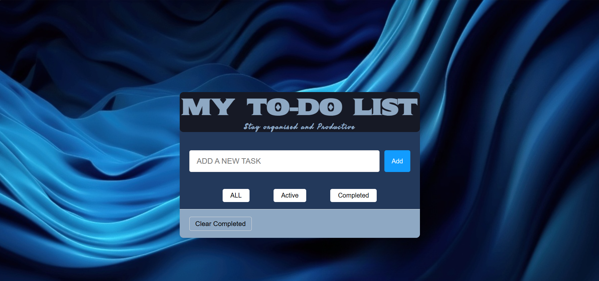

# My To-Do List

A simple, responsive to-do list app built with vanilla HTML, CSS, and JavaScript. Tasks persist across page reloads using the browser's localStorage.

## Features

- Add new tasks
- Mark tasks complete with an animated fade + line-through
- Filter tasks by All / Active / Completed
- Clear all completed tasks at once
- Data persists locally — no backend required

## Tech

- HTML5
- CSS3 (custom properties, transitions, pseudo-elements)
- Vanilla JavaScript (DOM manipulation, event delegation, localStorage)

## Running locally

Clone the repo and open `index.html` in a browser — no build step or server required.

\`\`\`bash
git clone <your-repo-url>
cd <your-repo-folder>
open index.html
\`\`\`

## Screenshots
